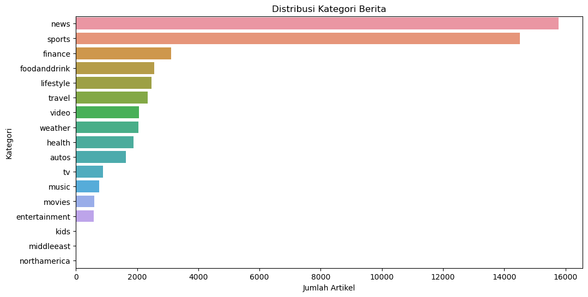
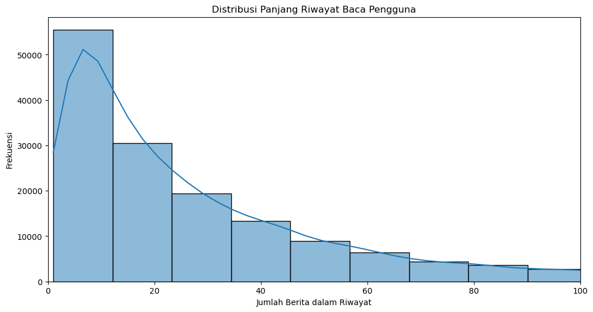
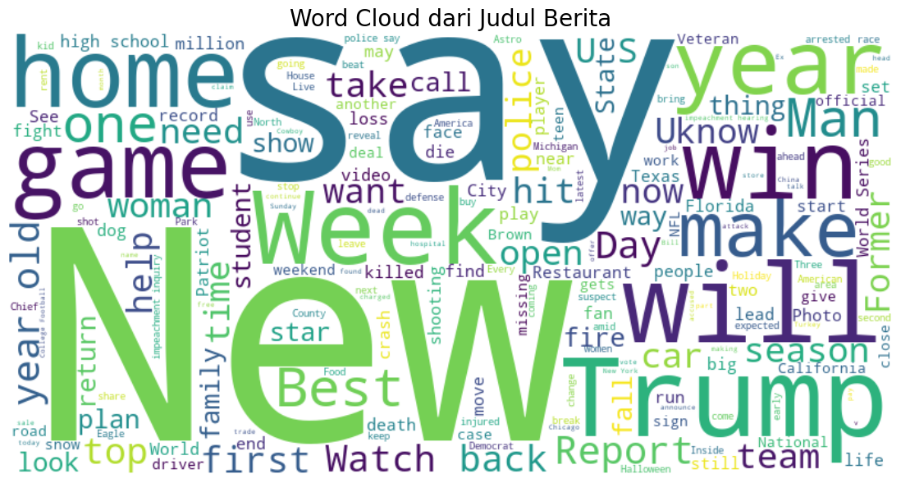

# Laporan Proyek Machine Learning - Sistem Rekomendasi Berita

- **Nama:** Muhammad Husain Fadhlillah
- **Email Student:** mc006d5y2343@student.devacademy.id
- **Cohort ID:** MC006D5Y2343

## Project Overview

Di era digital saat ini, informasi mengalir dengan deras dan tanpa henti. Setiap hari, ribuan artikel berita baru diterbitkan secara online dari berbagai sumber di seluruh dunia. Fenomena yang dikenal sebagai **information overload** ini menyulitkan pengguna untuk menemukan berita yang relevan dan sesuai dengan minat mereka di antara lautan konten yang tersedia [1]. Pengguna sering kali merasa lelah dan kewalahan saat harus menyaring berita secara manual, yang dapat menyebabkan turunnya keterlibatan (_engagement_) pada platform berita.

Sistem rekomendasi hadir sebagai solusi teknologi untuk mengatasi masalah ini. Dengan menganalisis konten berita dan perilaku pengguna di masa lalu, sistem ini dapat menyajikan daftar artikel yang dipersonalisasi untuk setiap individu. Hal ini tidak hanya meningkatkan pengalaman pengguna dengan menyajikan konten yang relevan, tetapi juga membantu platform berita untuk meningkatkan metrik penting seperti waktu baca, jumlah klik, dan retensi pengguna [2].

Proyek ini bertujuan untuk membangun model sistem rekomendasi berita yang efektif dengan mengeksplorasi dan membandingkan dua pendekatan utama: _Content-Based Filtering_ dan _Collaborative Filtering_. Dengan mengimplementasikan dan mengevaluasi kedua pendekatan ini, kita dapat memahami kelebihan dan kekurangan masing-masing serta menentukan pendekatan mana yang lebih unggul untuk memberikan rekomendasi yang akurat dan relevan kepada pengguna.

### Referensi

[1] Wu, F., Qiao, Y., Chen, J., Wu, C., Qi, T., Lian, J., ... & Xie, X. (2020). MIND: A Large-scale Dataset for News Recommendation. _Proceedings of the 58th Annual Meeting of the Association for Computational Linguistics_. [https://doi.org/10.18653/v1/2020.acl-main.331](https://doi.org/10.18653/v1/2020.acl-main.331)

[2] Koren, Y., Bell, R., & Volinsky, C. (2009). Matrix factorization techniques for recommender systems. _Computer_, 42(8), 30-37. [https://doi.org/10.1109/MC.2009.263](https://doi.org/10.1109/MC.2009.263)

## Business Understanding

### Problem Statements

Berdasarkan latar belakang yang telah diuraikan, berikut adalah rumusan masalah utama yang akan diselesaikan dalam proyek ini:

- Pengguna platform berita menghadapi kesulitan dalam menemukan artikel yang sesuai dengan minat pribadi mereka di tengah volume konten yang sangat besar.
- Platform berita membutuhkan cara yang efektif untuk meningkatkan keterlibatan dan retensi pengguna dengan menyajikan konten yang dipersonalisasi.
- Bagaimana cara membangun dan membandingkan dua pendekatan sistem rekomendasi yang berbeda (berbasis konten dan berbasis perilaku pengguna) untuk menentukan solusi yang paling efektif?

### Goals

Tujuan utama dari proyek ini adalah sebagai berikut:

- Mengembangkan model sistem rekomendasi dengan pendekatan **Content-Based Filtering** yang mampu menyarankan artikel berita berdasarkan kemiripan konten (kategori dan judul).
- Mengembangkan model sistem rekomendasi dengan pendekatan **Collaborative Filtering** yang mampu menyarankan artikel berita berdasarkan riwayat interaksi dan kesamaan selera antar pengguna.
- Mengevaluasi kedua model secara kuantitatif menggunakan metrik yang relevan (_Precision@10_) untuk menentukan pendekatan mana yang memberikan rekomendasi paling akurat.

### Solution Statements

Untuk mencapai tujuan tersebut, diajukan dua pendekatan solusi sebagai berikut:

1.  **Content-Based Filtering**: Solusi pertama adalah membuat model yang menganalisis atribut dari berita itu sendiri. Model ini akan menggunakan fitur seperti **kategori** dan **judul berita**. Dengan menggunakan teknik _Term Frequency-Inverse Document Frequency_ (TF-IDF) dan _Cosine Similarity_, model akan mencari artikel berita lain yang paling mirip dengan artikel yang pernah dibaca pengguna. Pendekatan ini cocok untuk memberikan rekomendasi yang spesifik dan relevan dengan minat eksplisit pengguna.
2.  **Collaborative Filtering**: Solusi kedua adalah membangun model berdasarkan perilaku kolektif para pengguna. Model ini akan mengidentifikasi pengguna dengan pola baca yang serupa dan merekomendasikan artikel yang populer di antara kelompok pengguna tersebut tetapi belum dibaca oleh pengguna target. Pendekatan ini menggunakan algoritma _Singular Value Decomposition_ (SVD) untuk menemukan pola laten dalam data interaksi pengguna-berita, yang memungkinkan penemuan rekomendasi yang lebih beragam (_serendipitous_).

## Data Understanding

Dataset yang digunakan dalam proyek ini adalah **"MIND-Small: Microsoft News Recommendation"**. MIND adalah dataset berskala besar untuk penelitian rekomendasi berita yang dikumpulkan dari perilaku pengguna anonim di Microsoft News. Versi "small" yang digunakan dalam proyek ini berisi data dari 50.000 pengguna selama 6 minggu.

- **Sumber Dataset:** [MIND: Microsoft News Recommendation Dataset on Kaggle](https://www.kaggle.com/datasets/arashnic/mind-news-dataset)

Dataset ini terdiri dari dua file utama: `news.tsv` dan `behaviors.tsv`.

### Variabel pada Dataset

Berikut adalah penjelasan untuk setiap variabel (kolom) dalam dataset:

**1. `news.tsv` (Informasi Konten Berita)**

- `News_ID`: ID unik untuk setiap artikel berita.
- `Category`: Kategori utama berita (misalnya, _sports_, _finance_, _health_).
- `SubCategory`: Sub-kategori yang lebih spesifik.
- `Title`: Judul artikel berita.
- `Abstract`: Ringkasan konten artikel berita.
- `URL`: URL ke artikel asli (tidak digunakan dalam pemodelan).
- `Title_Entities`: Entitas (misalnya, nama orang, organisasi) yang terdeteksi di judul (tidak digunakan dalam pemodelan).
- `Abstract_Entities`: Entitas yang terdeteksi di abstrak (tidak digunakan dalam pemodelan).

**2. `behaviors.tsv` (Informasi Perilaku Pengguna)**

- `Impression_ID`: ID unik untuk setiap sesi impresi.
- `User_ID`: ID unik untuk setiap pengguna.
- `Time`: Waktu saat impresi terjadi.
- `History`: Daftar `News_ID` yang pernah diklik pengguna di masa lalu, dipisahkan oleh spasi.
- `Impressions`: Daftar berita yang ditampilkan kepada pengguna dalam sesi tersebut, beserta label klik (`-1` untuk diklik, `-0` untuk tidak).

### Inspeksi Awal Data

Berdasarkan analisis awal menggunakan fungsi `.info()` dan `.describe()`, didapatkan informasi berikut:

- **Struktur Data:** Dataset ini terdiri dari dua tabel utama.

  - `df_news`: Tabel ini berisi metadata konten berita dan terdiri dari **51.282 baris** (artikel unik) dan 8 kolom (fitur). Sebagian besar fitur bertipe `object` (teks).
  - `df_behaviors`: Tabel ini berisi data interaksi pengguna dan terdiri dari **156.965 baris** (sesi impresi) dan 5 kolom. Tipe datanya campuran, yaitu `int64` untuk `Impression_ID` dan `object` untuk sisanya.

- **Kualitas Data:**

  - Tidak ditemukan adanya baris duplikat pada kedua DataFrame.
  - Ditemukan adanya **nilai yang hilang (_missing values_)**:
    - Pada `df_news`, kolom `Abstract` memiliki nilai yang hilang (hanya 48.616 dari 51.282 baris yang terisi). Kolom `Title_Entities` dan `Abstract_Entities` juga memiliki beberapa nilai yang hilang. Namun, kolom kunci untuk pemodelan berbasis konten kita (`Title` dan `Category`) tidak memiliki nilai yang hilang.
    - Pada `df_behaviors`, kolom `History` memiliki nilai yang hilang (hanya 153.727 dari 156.965 baris yang terisi). Ini adalah insight penting yang kemungkinan besar mengindikasikan adanya **pengguna baru** yang belum memiliki riwayat baca saat sesi mereka dicatat, sebuah manifestasi dari masalah _cold start_.

- **Statistik Deskriptif:**
  - Karena sebagian besar data bersifat kategorikal atau teks, statistik deskriptif standar (seperti mean, std) tidak terlalu relevan. Namun, analisis distribusi dari tahap EDA memberikan wawasan statistik:
    - **Distribusi Kategori Berita**: Fitur `Category` sangat **tidak seimbang (_imbalanced_)**. Kategori 'news' memiliki frekuensi lebih dari 20.000, sedangkan kategori lain seperti 'sports' hanya sekitar 6.000, dan kategori lainnya jauh lebih sedikit.
    - **Distribusi Aktivitas Pengguna**: Data `History` juga menunjukkan distribusi yang sangat miring (_skewed_). Sebagian besar pengguna memiliki riwayat baca yang sangat pendek (0-20 artikel), sementara hanya segelintir _power users_ yang memiliki riwayat yang sangat panjang. Hal ini mengindikasikan bahwa masalah **kelangkaan data (_data sparsity_)** akan menjadi tantangan utama untuk model _Collaborative Filtering_.

### Exploratory Data Analysis (EDA)

EDA dilakukan untuk memahami karakteristik dan distribusi data lebih dalam.

**1. Distribusi Kategori Berita**



_Gambar 1: Distribusi Jumlah Artikel per Kategori_

- **Insight:** Grafik di atas menunjukkan bahwa distribusi kategori berita **sangat tidak seimbang (_imbalanced_)**. Kategori **'news'** dan **'sports'** sangat mendominasi dataset, sementara kategori lain memiliki jumlah artikel yang jauh lebih sedikit. Fenomena ini dikenal sebagai _long-tail distribution_ dan dapat menyebabkan bias pada model, di mana model mungkin cenderung lebih sering merekomendasikan kategori yang dominan.

**2. Distribusi Panjang Riwayat Baca Pengguna**



_Gambar 2: Distribusi Panjang Riwayat Interaksi Pengguna_

- **Insight:** Histogram ini juga menunjukkan distribusi _long-tail_. Sebagian besar pengguna adalah **pengguna kasual** dengan riwayat baca yang sangat pendek (mayoritas < 20 artikel). Hanya ada sejumlah kecil **power users** dengan riwayat yang sangat panjang. Hal ini mengonfirmasi adanya tantangan _data sparsity_ dan _cold start_ untuk mayoritas pengguna, yang akan lebih sulit untuk diberikan rekomendasi akurat oleh model _Collaborative Filtering_.

**3. Word Cloud dari Judul Berita**



_Gambar 3: Word Cloud dari Judul Berita_

- **Insight:** _Word cloud_ ini memberikan gambaran kualitatif tentang topik yang paling sering muncul. Kata-kata seperti **`Trump`**, **`US`**, **`Health`**, **`Foods`**, dan **`game`** sangat menonjol, yang mengonfirmasi fokus konten pada berita politik, kesehatan, dan olahraga, selaras dengan hasil distribusi kategori. Kata umum seperti **`says`** juga dominan, yang merupakan _stop word_ kontekstual dalam berita.

## Data Preparation

Tahapan ini krusial untuk mentransformasi data mentah menjadi format yang siap untuk pemodelan.

### 1. Pembersihan Data dari Nilai Hilang

- **Metode**: Menggunakan fungsi `pandas.dropna()` pada `df_news` untuk menghapus baris di mana kolom `Title` atau `Category` kosong.
- **Alasan**: Langkah ini menjamin integritas fitur yang akan digunakan. Model _Content-Based_ kita sangat bergantung pada judul dan kategori, sehingga baris tanpa informasi ini tidak akan berguna dan harus dihilangkan untuk mencegah error dan hasil yang tidak akurat.

### 2. Pengambilan Sampel (_Sampling_) Data Perilaku

- **Metode**: Menggunakan `pandas.sample(n=50000, random_state=42)` pada `df_behaviors`.
- **Alasan**: Dataset `behaviors.tsv` asli cukup besar. Sampling dilakukan untuk mempercepat proses komputasi pada tahap pelatihan dan evaluasi, terutama pada mesin dengan sumber daya terbatas. Penggunaan `random_state` memastikan bahwa sampel yang diambil selalu konsisten, sehingga hasil proyek dapat direproduksi.

### 3. Rekayasa Fitur dari Riwayat Interaksi

- **Metode**: Melakukan iterasi pada kolom `History` dari `df_behaviors_sample`, memisahkan string `News_ID` berdasarkan spasi, dan menyusunnya kembali menjadi DataFrame baru (`df_interaction`) dengan format _long_ (satu baris untuk setiap pasangan `User_ID` dan `News_ID`).
- **Alasan**: Format asli kolom `History` tidak bisa langsung digunakan oleh model. Transformasi ini mengubah data dari format _wide_ ke format _long_, yang merupakan struktur standar untuk data interaksi dalam sistem rekomendasi, terutama untuk model _Collaborative Filtering_.

### 4. Penggabungan Data

- **Metode**: Menggunakan `pd.merge()` untuk menggabungkan `df_interaction` dengan `df_news_cleaned` berdasarkan kolom kunci `News_ID`.
- **Alasan**: Langkah ini sangat penting untuk memperkaya data interaksi dengan metadata kontennya. Hasilnya, `df_full_interaction`, adalah dataset terpadu yang berisi informasi pengguna, berita yang mereka baca, beserta kategori dan judul berita tersebut, yang siap digunakan oleh kedua model.

### 4. Persiapan untuk Content-Based Filtering

- **Metode**: **Representasi Fitur dengan TF-IDF**. Menggunakan `TfidfVectorizer` dari `scikit-learn` untuk mengubah fitur teks gabungan (`Title` dan `Category`) menjadi matriks fitur numerik.
- **Alasan**: Model _machine learning_ tidak dapat memproses teks mentah. **TF-IDF** dipilih karena kemampuannya yang sangat baik dalam mengkuantifikasi teks, memberikan bobot yang lebih tinggi pada kata-kata yang penting untuk sebuah berita tetapi jarang muncul di berita lain. Ini efektif untuk mengidentifikasi kata kunci yang paling deskriptif untuk setiap artikel.

### 5. Persiapan untuk Collaborative Filtering

- **Metode**: **Adaptasi Data untuk Faktorisasi Matriks**. Menambahkan kolom `Rating` dengan nilai `1` pada setiap baris di DataFrame interaksi.
- **Alasan**: Algoritma SVD pada _library_ `surprise` dirancang untuk data rating eksplisit. Karena data kita bersifat implisit (berdasarkan klik), kita mengadaptasinya dengan menetapkan rating `1` untuk setiap interaksi. Ini secara efektif memberitahu model bahwa setiap klik adalah sinyal preferensi positif yang kuat dari pengguna, sebuah langkah persiapan yang umum dan valid..

## Modeling and Result

### Model 1: Content-Based Filtering

- **Definisi dan Cara Kerja**:
  _Content-Based Filtering_ adalah pendekatan yang merekomendasikan item berdasarkan kemiripan atribut atau "konten" dari item itu sendiri. Model ini bekerja dengan cara:

  - **Perhitungan Kemiripan**: Menghitung kemiripan antara vektor dari satu berita dengan semua berita lainnya menggunakan metrik **Cosine Similarity**. Skor kemiripan yang tinggi (mendekati 1) menunjukkan konten yang sangat mirip.

- **Konteks dalam Proyek**:
  Model ini bertujuan menjawab pertanyaan: "Jika seorang pengguna menyukai berita X, berita lain apa yang kontennya paling mirip dengan X?"

- **Implementasi (Parameter & Kode)**:
  Model diimplementasikan menggunakan `TfidfVectorizer` dari Scikit-learn tanpa parameter khusus (menggunakan default). Fungsi `get_content_based_recommendations` dibuat untuk membungkus logika rekomendasi secara efisien.

  ```python
  def get_content_based_recommendations(title, tfidf_matrix, df, indices_map):
      # Logika untuk mencari indeks, menghitung cosine similarity, dan mengurutkan hasil
      ...
      return df[['Title', 'Category']].iloc[news_indices]
  ```

- **Hasil Rekomendasi**:

  Untuk input berita _"50 Foods You Should Never Eat, According to Health Experts"_, model memberikan rekomendasi berikut:

  | Title                                             | Category     |
  | :------------------------------------------------ | :----------- |
  | How Much Protein You Should Actually Eat in On... | health       |
  | 50 famous foods you should eat in your lifetime   | foodanddrink |
  | 50 Awful Foods That Should Never Be in Your Ki... | health       |
  | 3 Foods You Should Eat at Breakfast If You Wan... | health       |
  | The 5 worst dishes you can eat at buffet, acco... | health       |
  | 10 Exercises You Should Never Do Again, Accord... | health       |
  | 100 Worst Foods to Eat When You're Sick           | health       |
  | 21 Frozen Foods You Should Never Put in Your Cart | health       |
  | 40 Health Symptoms You Should Never Ignore        | health       |
  | Heart Health Symptoms You Should Never Ignore     | health       |

  _Tabel 1: Contoh Top-10 Rekomendasi dari Model Content-Based_

- **Kelebihan dan Kekurangan**:
  - **Kelebihan**: Tidak memerlukan data dari pengguna lain, sehingga tidak mengalami masalah _user cold start_. Rekomendasinya juga transparan dan mudah dijelaskan (misalnya, "kami merekomendasikan ini karena topiknya sama").
  - **Kekurangan**: Cenderung menghasilkan rekomendasi yang terlalu mirip (_over-specialization_) dan kurang beragam. Model ini kesulitan menemukan topik baru yang mungkin disukai pengguna (_low serendipity_).

### Model 2: Collaborative Filtering (SVD)

- **Definisi dan Cara Kerja**:
  _Collaborative Filtering_ adalah pendekatan yang merekomendasikan item berdasarkan pola perilaku dari sekelompok besar pengguna. Algoritma **SVD** (_Singular Value Decomposition_) yang digunakan adalah teknik faktorisasi matriks. Ia bekerja dengan:

  - **Prediksi**: Faktor laten ini menangkap preferensi tersembunyi pengguna dan karakteristik item. Skor preferensi untuk item yang belum dilihat diprediksi dengan menghitung _dot product_ antara vektor laten pengguna dan vektor laten item.

- **Konteks dalam Proyek**:
  Model ini bertujuan menjawab pertanyaan: "Berita apa yang disukai oleh pengguna lain yang seleranya mirip dengan Anda?"

- **Implementasi (Parameter & Kode)**:
  Model diimplementasikan menggunakan `SVD` dari _library_ `surprise`. Parameter utama yang digunakan adalah:

  - `n_factors=50`: Jumlah faktor laten yang digunakan untuk merepresentasikan pengguna dan item.
  - `n_epochs=20`: Jumlah iterasi pelatihan pada seluruh dataset.
  - `random_state=42`: Untuk memastikan hasil yang dapat direproduksi.

  ```python
  def get_collaborative_filtering_recommendations(user_id, model, ...):
      # Logika untuk filter berita, prediksi skor, dan pengurutan
      ...
      return df_n[df_n['News_ID'].isin(top_n_news_ids)]
  ```

- **Hasil Rekomendasi**:

  Untuk input pengguna `U46778`, model memberikan rekomendasi berikut:

  | Title                                             | Category      |
  | :------------------------------------------------ | :------------ |
  | The Brands Queen Elizabeth, Prince Charles, an... | lifestyle     |
  | 50 Worst Habits For Belly Fat                     | health        |
  | The Cost of Trump's Aid Freeze in the Trenches... | news          |
  | I Was An NBA Wife. Here's How It Affected My M... | health        |
  | How to Get Rid of Skin Tags, According to a De... | health        |
  | Should NFL be able to fine players for critici... | sports        |
  | It's been Orlando's hottest October ever so fa... | weather       |
  | Chile: Three die in supermarket fire amid prot... | news          |
  | Best PS5 games: top PlayStation 5 titles to lo... | entertainment |
  | How to report weather-related closings, delays    | news          |

  _Tabel 2: Contoh Top-10 Rekomendasi dari Model Collaborative Filtering_

- **Kelebihan dan Kekurangan**:
  - **Kelebihan**: Mampu menghasilkan rekomendasi yang beragam dan mengejutkan (_serendipitous_) karena tidak bergantung pada konten.
  - **Kekurangan**: Mengalami masalah _cold start_ (kesulitan memberi rekomendasi untuk pengguna baru atau item baru yang belum memiliki interaksi). Membutuhkan data interaksi yang besar untuk dapat bekerja dengan baik.

## Evaluation

### Metrik Evaluasi: Precision@k

- **Definisi**:
  _Precision@k_ adalah metrik evaluasi yang mengukur seberapa relevan rekomendasi yang diberikan dalam daftar Top-k. Metrik ini menjawab pertanyaan: "Dari _k_ item teratas yang direkomendasikan, berapa proporsi yang benar-benar relevan bagi pengguna?"

- **Formula/Rumus**:
  $$\text{Precision@k} = \frac{\text{|{Item yang Direkomendasikan}|} \cap \text{|{Item yang Relevan}|}}{k}$$

- **Cara Kerja**:
  Meskipun metrik yang digunakan sama, cara kerjanya sedikit berbeda untuk kedua model karena sifatnya yang berbeda:

  - **Untuk Model 2: Collaborative Filtering**:

    1.  Data interaksi pengguna dibagi menjadi **train set (80%)** untuk melatih model dan **test set (20%)** sebagai _ground truth_.
    2.  Model SVD dilatih hanya menggunakan `train set`.
    3.  Model kemudian diminta untuk memprediksi preferensi pengguna untuk item-item yang ada di `test set`.
    4.  Untuk setiap pengguna, kita ambil _k_ item dengan skor prediksi tertinggi sebagai daftar rekomendasi.
    5.  Jumlah item dalam daftar rekomendasi yang benar-benar ada di `test set` pengguna dihitung sebagai "hits".
    6.  Precision@k adalah jumlah "hits" dibagi dengan _k_, kemudian dirata-ratakan untuk semua pengguna.

  - **Untuk Model 1: Content-Based Filtering**:
    1.  Karena model ini tidak menggunakan _train-test split_, evaluasi dilakukan melalui **simulasi offline**.
    2.  Untuk setiap pengguna yang memiliki riwayat baca lebih dari satu, kita ambil satu artikel (misalnya, yang pertama) sebagai **sumber atau input** untuk model.
    3.  Sisa dari riwayat baca pengguna tersebut dianggap sebagai **ground truth** (item yang relevan).
    4.  Model menghasilkan _k_ rekomendasi berdasarkan artikel sumber.
    5.  Jumlah item dalam daftar rekomendasi yang juga ada di _ground truth_ pengguna dihitung sebagai "hits".
    6.  Precision@k adalah jumlah "hits" dibagi dengan _k_, kemudian dirata-ratakan untuk semua pengguna yang disimulasikan.

- **Konteks dalam Proyek**:
  Metrik ini sangat cocok untuk tujuan bisnis proyek, yaitu menyajikan daftar rekomendasi yang berguna. Kita tidak perlu tahu apakah pengguna akan menyukai _semua_ berita, tetapi kita ingin memastikan bahwa 10 berita yang kita tampilkan memiliki kemungkinan besar untuk disukai. _Precision@10_ mengukur efektivitas daftar pendek ini secara langsung untuk kedua model, sehingga memungkinkan perbandingan performa yang adil dan seimbang.

### Hasil Evaluasi

Berikut adalah hasil evaluasi kuantitatif dari kedua model.

| Model                             | Precision@10 |
| :-------------------------------- | :----------- |
| Content-Based Filtering           | 0.0032       |
| **Collaborative Filtering (SVD)** | **0.5312**   |

_Tabel 3: Perbandingan Hasil Evaluasi Model_

### Kesimpulan Hasil Evaluasi

Berdasarkan tabel perbandingan di atas, terlihat bahwa **Collaborative Filtering (SVD)** memiliki nilai `Precision@10` yang jauh lebih tinggi (sekitar **0.53**) dibandingkan dengan **Content-Based Filtering** (sekitar **0.003**).

Hal ini dapat disimpulkan sebagai berikut:

- **Collaborative Filtering** lebih efektif dalam menangkap pola dan preferensi laten pengguna dari data interaksi historis. Model ini mampu memberikan rekomendasi yang lebih akurat karena belajar dari perilaku kolektif banyak pengguna.
- **Content-Based Filtering**, meskipun logis, memiliki performa yang sangat rendah dalam kasus ini. Hal ini kemungkinan disebabkan oleh keterbatasan fitur konten yang digunakan (hanya judul dan kategori) dan sifatnya yang cenderung merekomendasikan item yang sangat mirip, sehingga gagal menangkap keragaman selera pengguna.

Dengan demikian, untuk implementasi sistem rekomendasi berita pada dataset ini, pendekatan **Collaborative Filtering menggunakan SVD adalah solusi yang jelas lebih unggul dan direkomendasikan**.
